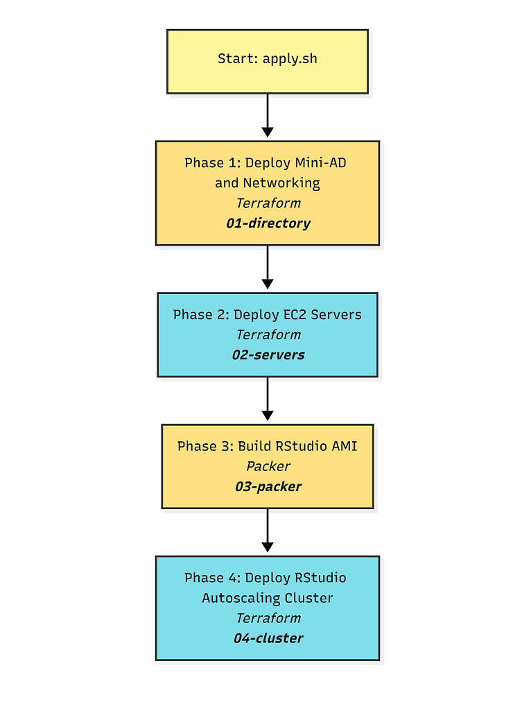
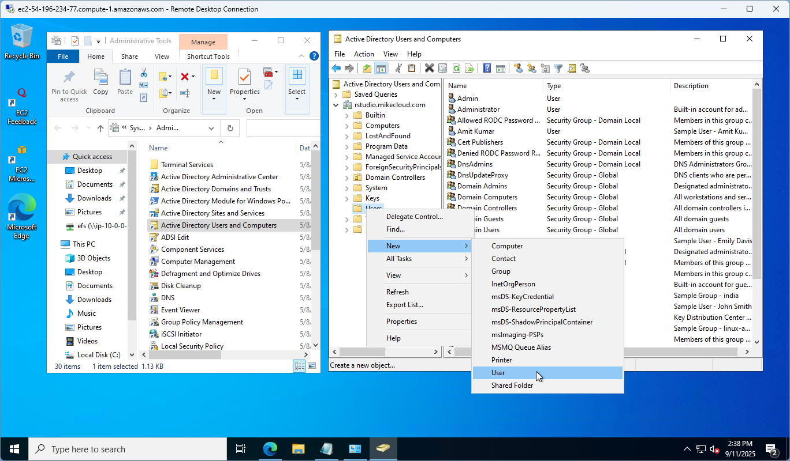
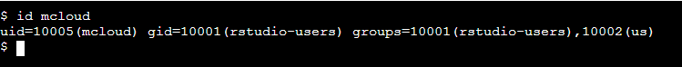

# AWS VS Code Cluster with Domain-Joined Session Broker

This project extends the original **AWS Mini Active Directory** lab by deploying a **browser-based VS Code cluster** on Amazon Web Services (AWS). It reproduces the core behavior of **Posit Workbench** — log into a web application, then get a private VS Code server session running under your own identity — without the commercial product.

The piece that makes this work is a small **session broker** written for this project. Unlike RStudio Server, `code-server` is a *single-user* process whose only authentication mode is a shared password. Pointing a load balancer straight at it would give every user the same identity and the same home directory. The broker supplies the missing multi-user layer:

1. Authenticate the user against Active Directory through PAM/SSSD.
2. Launch a private `code-server` process **as that Linux user** via `systemd-run`, bound to loopback.
3. Reverse-proxy the browser to it, including the WebSocket traffic the editor runs on.

Key capabilities demonstrated:

1. **VS Code Cluster with Load Balancer** – `code-server` sessions across multiple EC2 instances, fronted by an Application Load Balancer (ALB).
2. **EFS-Backed Home Directories** – EFS mounted at `/home`, so a user's files follow them regardless of which node serves their session.
3. **Mini Active Directory Integration** – A Samba-based mini-AD domain controller provides authentication and DNS, so VS Code logins are domain-based and centrally managed.

> **Note:** The architecture diagram has not yet been regenerated for this project. The `.drawio` source from the RStudio version was removed rather than left stale.

## Prerequisites

* [An AWS Account](https://aws.amazon.com/console/)
* [Install AWS CLI](https://docs.aws.amazon.com/cli/latest/userguide/getting-started-install.html)
* [Install Latest Terraform](https://developer.hashicorp.com/terraform/install)
* [Install Latest Packer](https://developer.hashicorp.com/packer/install)

If this is your first time watching our content, we recommend starting with this video: [AWS + Terraform: Easy Setup](https://youtu.be/BCMQo0CB9wk). It provides a step-by-step guide to properly configure Terraform, Packer, and the AWS CLI.

## Build WorkFlow



## Download this Repository

```bash
git clone https://github.com/mamonaco1973/aws-vscode-cluster.git
cd aws-vscode-cluster
```

## Build the Code

Run [check_env](check_env.sh) to validate your environment, then run [apply](apply.sh) to provision the infrastructure.

```bash
develop-vm:~/aws-vscode-cluster$ ./apply.sh
NOTE: Validating required commands in PATH.
NOTE: Found required command: aws
NOTE: Found required command: terraform
NOTE: Found required command: jq
NOTE: Found required command: packer
NOTE: All required commands are available.
NOTE: Verifying AWS CLI connectivity...
NOTE: AWS CLI authentication successful.
NOTE: Building Active Directory instance...
```

The deployment runs in four phases:

| Phase | Directory | What it builds |
|-------|--------------|----------------|
| 1 | `01-directory` | Samba 4 mini-AD domain controller, VPC, NAT |
| 2 | `02-servers` | EFS, Windows AD admin host, Linux/Samba gateway |
| 3 | `03-packer` | Custom AMI: `code-server` + session broker |
| 4 | `04-cluster` | ALB, Auto Scaling Group, launch template |

### Build Results

When the deployment completes, the following resources are created:

- **Networking:**
  - A VPC with public and private subnets
  - Internet Gateway and NAT Gateway for controlled outbound access
  - Route tables configured to direct traffic through NAT for private subnets
  - DNS resolution provided by the Mini-AD domain controller

- **Security & IAM:**
  - Security groups for the domain controller, cluster nodes, ALB, and EFS mount targets
  - IAM roles and instance profiles enabling EC2 nodes to use AWS Systems Manager and mount EFS
  - Secrets stored in AWS Secrets Manager for AD administrator and test user credentials

- **Active Directory Server:**
  - Ubuntu EC2 instance running Samba 4 as a Domain Controller and DNS server
  - Configured Kerberos realm and NetBIOS name for centralized authentication
  - Integrated with the VS Code cluster for domain-based logins

- **Amazon EFS:**
  - Elastic File System provisioned with mount targets in each private subnet
  - Security group allowing NFS traffic (TCP/2049) from cluster nodes
  - Mounted at `/home` so user files are available from any node
  - `/efs/extensions` provided as a shared staging area for VSIX packages

- **Custom VS Code AMI:**
  - Built with Packer to include `code-server`, the session broker, and bootstrap scripts
  - PAM stack at `/etc/pam.d/vscode` wired to SSSD for domain authentication
  - Ready for deployment across the autoscaling cluster

- **VS Code Autoscaling Cluster:**
  - Auto Scaling Group of EC2 instances using the custom AMI
  - Application Load Balancer terminating HTTPS and forwarding to the broker on port 8080
  - Domain-joined at launch, with EFS-backed home directories

- **Validation:**
  - Automated checks via `./validate.sh` report the ALB endpoint and confirm the broker answers `/healthz`

## How the Session Broker Works

The broker lives at [03-packer/broker/broker.py](03-packer/broker/broker.py) and runs as `vscode-broker.service` on every cluster node.

| Route | Behavior |
|-------|----------|
| `GET /healthz` | Unauthenticated health check for the ALB target group |
| `GET /login` | Renders the sign-in form |
| `POST /login` | PAM authentication via SSSD, then sets a signed session cookie |
| `GET /logout` | Stops the user's `code-server` process and clears the cookie |
| everything else | Reverse-proxied to the user's own `code-server` on `127.0.0.1` |

Each session runs as a transient systemd unit named `vscode-<username>`, started with `--uid` so the process holds the user's real POSIX identity. You can inspect them directly on any node:

```bash
systemctl list-units 'vscode-*'
journalctl -u vscode-jsmith
```

Sessions idle for longer than `SESSION_IDLE_MINUTES` (default 120) are reaped. Configuration lives in `/etc/vscode-broker.env`, written at boot by the launch template.

### Design Trade-offs

These are deliberate choices, not oversights:

- **One session per user, pinned to one node.** The ALB uses cookie stickiness because a user's `code-server` process exists on exactly one instance. If that instance is replaced, the session is gone and the user signs in again. This matches RStudio Server Community — load-balancing sessions across nodes is a paid Workbench feature.
- **Scale-up only.** The ASG has no scale-down policy. Scaling in would terminate nodes holding live sessions, so the cluster grows under load but does not shrink automatically.
- **Editor state is node-local.** `code-server` keeps its state in SQLite, and SQLite over NFS is a well-known corruption risk. State lives at `/var/lib/vscode/<user>` on instance storage while user *files* live on EFS-backed `/home`. Losing a node costs editor layout and installed extensions, never work.
- **`--auth none` on each `code-server`.** Safe only because every instance binds to loopback and the security group admits port 8080 from the ALB alone. The broker is the only path in. Do not widen the bind address.
- **HTTPS with a self-signed certificate.** The ALB terminates TLS using a certificate generated by Terraform and imported into ACM; port 80 only redirects to 443. This is not optional polish. Over plain HTTP, ISP and carrier security products inspect the page inline, classify the sign-in form as phishing, and block it — and some mobile carriers also corrupt the WebSocket upgrade that code-server depends on. TLS ends both. The cost is a one-time browser warning about the untrusted issuer; the certificate's common name matches the ALB DNS name, so there is no hostname mismatch on top of it. To remove the warning, swap `acm.tf` for a DNS-validated certificate on a domain you control.

### Licensing

This project deliberately uses only the open-source path, which is what makes self-hosting a multi-user service viable:

| Component | License | Notes |
|-----------|---------|-------|
| `code-server` | MIT (Coder) | Installed from the official upstream script |
| Extension gallery | Open VSX (Eclipse) | Pinned explicitly in `/etc/vscode-gallery.env` |
| Session broker | This repository | Written for this project |

**Do not repoint `EXTENSIONS_GALLERY` at Microsoft's Marketplace.** The Marketplace terms permit access only from official Microsoft products, so that one change would make an otherwise lawful deployment non-compliant without altering any code. It is the realistic way this build gets broken — usually by someone chasing a single missing extension.

Microsoft's own `code serve-web` / VS Code Server is under a proprietary license and is **not** interchangeable with `code-server` here, regardless of operating system.

For extensions absent from Open VSX, obtain the `.vsix` from the publisher directly and stage it under `/efs/extensions`, where it is available to every node.

### Users and Groups

As part of this project, when the domain controller is provisioned, a set of sample **users** and **groups** are automatically created through Terraform-provisioned scripts running on the mini-ad server. These resources are intended for **testing and demonstration purposes**, showcasing how to automate user and group provisioning in a self-managed Active Directory environment.

#### Groups Created

| Group Name    | Group Category | Group Scope | gidNumber |
|---------------|----------------|-------------|-----------|
| vscode-users  | Security       | Universal   | 10001     |
| india         | Security       | Universal   | 10002     |
| us            | Security       | Universal   | 10003     |
| linux-admins  | Security       | Universal   | 10004     |
| vscode-admins | Security       | Universal   | 10005     |

#### Users Created and Group Memberships

| Username | Full Name   | uidNumber | gidNumber | Groups Joined                    |
|----------|-------------|-----------|-----------|-----------------------------------|
| jsmith   | John Smith  | 10001     | 10001     | vscode-users, us, linux-admins, vscode-admins    |
| edavis   | Emily Davis | 10002     | 10001     | vscode-users, us                  |
| rpatel   | Raj Patel   | 10003     | 10001     | vscode-users, india, linux-admins, vscode-admins |
| akumar   | Amit Kumar  | 10004     | 10001     | vscode-users, india               |

Membership in **vscode-users** is what grants a session. The broker enforces it explicitly via `REQUIRED_GROUP`, in addition to the SSSD `access_provider = simple` restriction applied at domain join.

#### Understanding `uidNumber` and `gidNumber` for Linux Integration

The **`uidNumber`** (User ID) and **`gidNumber`** (Group ID) attributes are critical when integrating **Active Directory** with **Linux systems**, particularly in environments where **SSSD** ([System Security Services Daemon](https://sssd.io/)) or similar services are used for identity management. These attributes allow Linux hosts to recognize and map Active Directory users and groups into the **POSIX** (Portable Operating System Interface) user and group model.

### Creating a New VS Code User

Follow these steps to provision a new user in the Active Directory domain and validate their access to the cluster:

1. **Connect to the Domain Controller**
   - Log into the **`windows-ad-admin`** server via Remote Desktop (RDP).
   - Use the `rpatel` or `jsmith` credentials that were provisioned during cluster deployment.

2. **Launch Active Directory Users and Computers (ADUC)**
   - From the Windows Start menu, open **“Active Directory Users and Computers.”**
   - Enable **Advanced Features** under the **View** menu. This ensures you can access the extended attribute tabs (e.g., UID/GID mappings).

3. **Navigate to the Users Organizational Unit (OU)**
   - In the left-hand tree, expand the domain (e.g., `vscode.mikecloud.com`).
   - Select the **Users** OU where all cluster accounts are managed.

4. **Create a New User Object**
   - Right-click the Users OU and choose **New → User.**
   - Provide the following:
     - **Full Name:** Descriptive user name (e.g., “Mike Cloud”).
     - **User Logon Name (User Principal Name / UPN):** e.g., `mcloud@vscode.mikecloud.com`.
     - **Initial Password:** Set an initial password.



5. **Assign a Unique UID Number**
   - Open **PowerShell** on the AD server.
   - Run the script located at:
     ```powershell
     Z:\efs\aws-vscode-cluster\06-utils\getNextUID.bat
     ```
   - This script returns the next available **`uidNumber`** to assign to the new account.

6. **Configure Advanced Attributes**
   - In the new user's **Properties** dialog, open the **Attribute Editor** tab.
   - Set the following values:
     - `gidNumber` → **10001** (the shared GID for the `vscode-users` group).
     - `uid` → match the user's AD login ID (e.g., `mcloud`).
     - `uidNumber` → the unique numeric value returned from `getNextUID.ps1`.

7. **Add Group Memberships**
   - Go to the **Member Of** tab.
   - Add the user to the following groups:
     - **vscode-users** → grants standard VS Code session access.
     - **us** (or other geographic/departmental group as applicable).

8. **Validate User on Linux**
   - Open an **AWS Systems Manager (SSM)** session to the **`efs-samba-gateway`** instance.
   - Run the following command to confirm the user's identity mapping:
     ```bash
     id mcloud
     ```
   - Verify that the output shows the correct **UID**, **GID**, and group memberships (e.g., `vscode-users`).



9. **Validate VS Code Access**
   - Open the cluster's Application Load Balancer (ALB) URL in a browser (e.g., `https://vscode-alb-xxxxxx.us-east-1.elb.amazonaws.com`). Accept the self-signed certificate warning once.
   - Log in with the new AD credentials. The broker starts a private session on first request, which takes a few seconds.

10. **Verify Isolation**
    - Open a terminal inside VS Code and run `id` — it reports the signed-in AD user, not a shared service account.
    - `ls ~` shows that user's own EFS-backed home directory.
    - Users outside **vscode-users** are rejected at sign-in even with valid AD credentials.

---

✅ **Note:** Membership in **vscode-admins** is provided for future use (for example, granting write access to shared paths under `/efs`). Session access itself is governed by **vscode-users**.

### Troubleshooting

- **Targets never turn healthy** — check the broker on a node: `systemctl status vscode-broker` and `journalctl -u vscode-broker`. Nodes serve `/healthz` only after the domain join completes.
- **Login fails for a valid AD user** — confirm SSSD resolves them (`id <user>`) and that they are in `vscode-users`.
- **Session starts, page loads, but the editor spins with "handshake timed out"** — check the broker log for `server rejected WebSocket connection: HTTP 403`. code-server refuses a WebSocket upgrade whose `Origin` does not match its own host, as a CSRF defence. The broker rewrites `Origin` to the loopback upstream to satisfy it; if that line is removed the editor will never connect while every HTTP request continues to succeed, because the check applies only to upgrades.
- **Bootstrap problems** — the launch template's user-data log is at `/root/userdata.log` on each node.

Expected console noise that is **not** a fault:

| Message | Cause |
|---------|-------|
| `vsda_bg.wasm` / `vsda.js` 404 | Proprietary Microsoft module, absent from the MIT build |
| `github-authentication`, `emmet`, `git-base`, `merge-conflict` 404 | Built-in extensions the OSS build does not bundle |
| `Timed out waiting for authentication provider 'github'` | Follows from the above |
| `open-vsx.org/... 404` | Extension not published to Open VSX — also confirms the gallery pin is working |
| `Service Worker registration SecurityError` | Chrome will not register a Service Worker behind a self-signed certificate. Only a DNS-validated certificate removes this; the editor is fully functional without it |

### Clean Up Infrastructure

When you are finished testing, you can remove all provisioned resources with:

```bash
./destroy.sh
```

This will use Terraform to delete the VPC, EC2 instances, IAM roles, security groups, and any other infrastructure created by the project. Secrets stored in AWS Secrets Manager will also be deleted unless retention policies are configured.
